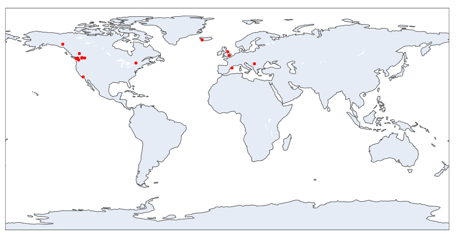
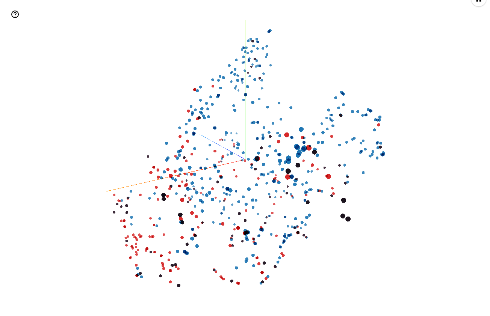

# Audio Descriptors Corpus

Analysis and data manegent for the audio descriptors study.

## Data Files
```descriptors_{date}.csv``` is the current edited survey data.\
```qualtrics_raw.csv``` is the data file directly from qualtrics.\
```qualtrics_edited.csv``` is the hand filtered qualtrics file.\
```DescriptorsLibrary.xlsx``` stores the official tags list for the literature and survey corpora along with the collated final list.\

## Dependencies

* Requirements listed in requirements.txt file
* Tested on Windows 10 / Linux
```
pip install -r requirements.txt
```

---

## Getting Current Statistics
```
python statistics.py
```
Results will look something like:
```
-------------- SURVEY STATS --------------
STAT                               VALUE   
-----------------------------------------------
total responses                    95.00
completion count                   28.00
abandon count                      67.00
completion rate %                  29.47
average completion time (m)        128.75
min completion time (m)            4.33
max completion time (m)            1324.68
trim mean completion time (m)      23.06
empty questions                    [1, 6, 27, 72]

-------------- SURVEY TAG STATS --------------
STAT                               VALUE   
-----------------------------------------------
total tags                         1072.00
total unique tags                  661.00
total unique tag/class pairs       724.00
total descriptor tags              585.00
unique descriptor tags             409.00
total emotion tags                 487.00
unique emotion tags                315.00
tags described as both             63.00
% tags in dictionary               93.80
% words in lit words               10.59
% not in lit words                 89.41

-------------- LITERATURE TAG STATS --------------
STAT                               VALUE
-----------------------------------------------
total tags                         232.00
% words in survey tags             30.17
% words not in survey tags         69.83

-------TAGS IN BOTH EMOTION AND DESCRIPTOR---------------
{'quick', 'shrill', 'light', 'powerful', 'scary', 'jarring', 'edgy', 'noisy', 'happy', 'annoying', 'warm', 'warning', 'busy', 'smooth', 'rhythmic', 'close', 'calming', 'natural', 'surprised', 'soft', 'chill', 'sharp', 'dynamic', 'conversational', 'mechanical', 'abrasive', 'blaring', 'dangerous', 'alarm', 'comfortable', 'expectant', 'urgent', 'mellow', 'uplifting', 'exciting', 'bright', 'playful', 'loud', 'awful', 'strident', 'on-edge', 'urgency', 'watery', 'ominous', 'falling', 'nature', 'empty', 'harmonious', 'dark', 'alarming', 'angry', 'energetic', 'futuristic', 'alert', 'artificial', 'fast', 'chaotic', 'grainy', 'hollow', 'movement', 'naturalistic', 'moist', 'enticing'}

-------MOST COMMON SURVEY TAGS------------
[('synthetic', 13), ('sharp', 12), ('bright', 12), ('annoying', 10), ('alarming', 10), ('exciting', 9), ('peaceful', 9), ('abrasive', 8), ('tense', 8), ('scary', 8)]
```

---



## Getting Word Embeddings as Tensors
```
python write_tensors.py
```

Survey responses only:
* tags_survey.tsv
* tensors_survey.tsv

Survey responses and literature descriptors:
* tags_all.tsv
* tensors_all.tsv

Survey responses with correlated question numbers:
* tags_questions.tsv
* tensors_questions.tsv

Output files stored in the **outputfiles** directory.

Plot here: https://projector.tensorflow.org/
Select the tensors file for vectors, and the corresponding tags file for metadata.



---

## Extracting Word Definitions
Run this file each time we collect new descriptor data in the *qualtrics_edited.csv* file. View the definitions in the *DescriptorsLibrary.xlsx* file on the *Survey Descriptors* sheet.

```
python definitions.py
```


---

## Todo
Entertaining spelt wrong in tags

## Author
Joshua Kranabetter